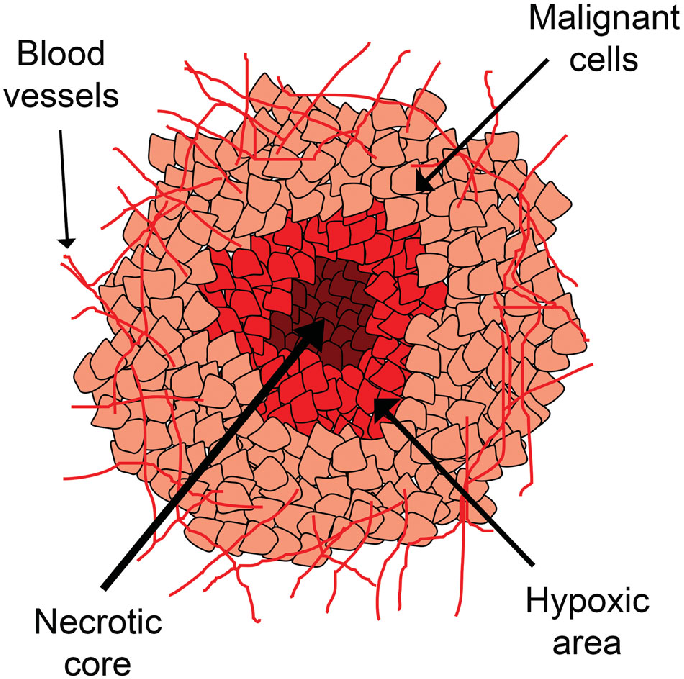

```         
SAMPLE TEXT
```
`

```{r echo=FALSE, include=FALSE}
knitr::opts_chunk$set(warning = FALSE, message = FALSE)
library(rmarkdown)
library(readxl)
library(haven)
library(knitr)
library(formatters)
library(gt)
library(tidyverse)
library(rlistings)
library(pharmaverseadam)
library(DT)
```
# M1234 Analysis<!--comment(ctr+shft+c)-->    

## Information
**Study**: 12345<!--two space for next line--> 
**Indication**: Solid Tumor    
**Study Start Date**: 8^th^Nov 2025<!--^th^ for superscript-->  
**cutoff Date**: 8^th^Nov 2025~dsur~<!-- ~dsur~ for superscript-->  
~~want to cross sentence~~

## *Image Header in Italic*
<div style="text-align: center;">  
---- This is the Image ----  

</div>

```{r echo=FALSE, fig.cap = "Fig of Solid Tumor", fig.height=1, fig.width=1}
knitr::include_graphics(("Schematic-representation-of-a-solid-tumor-mass-The-different-shades-of-red-in-the.png"))

```
## Inline Coding
```{r echo=FALSE}
ae_info <- adae %>% count(AETERM) %>%
  arrange(n) %>% slice(0:5)

```
Adverse events <u> `r ae_info$AETERM` </u>


## Dataset{.tabset}
### interactive
```{r echo=FALSE}
datatable(data.frame(adsl))
```

### Static
```{r echo=FALSE}
kable(head(adsl))
```

<!-- ## Plots -->
<!-- ```{r echo=FALSE,warning=FALSE, message=FALSE} -->
<!-- adlb <- ex_adlb %>% filter(PARAMCD == "ALT") -->
<!-- plot_ly(data = adlb, x = ~ADY, y = ~AVAL, color = ~USUBJID, type = "scatter", mode ="lines") %>%  -->
<!--         add_lines() %>% -->
<!--         layout( -->
<!--           title = "Lab Plot",  # Title of the plot -->
<!--           xaxis = list(title = "Time since treatment"),  # X-axis label -->
<!--           yaxis = list(title = "ALT"),  # Y-axis label -->
<!--           height = 300, width = 800  # Dimensions of the plot -->
<!--         ) -->
<!-- ``` -->

## loops {.tabset}
```{r echo=FALSE, results='asis'}
for (subject in adsl$USUBJID[1:5]){
    cat('\n')
    cat("###", subject, "\n")
    ae_info=adae %>% filter(USUBJID==subject)
    cat("#### Adverse Event:", ae_info$AETERM, "\n")
}
```
